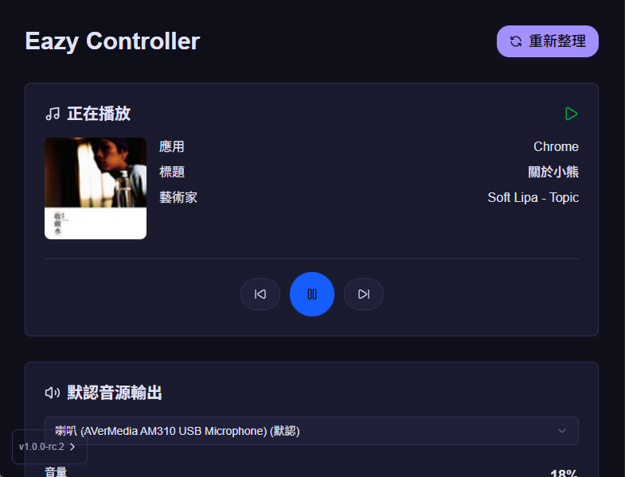
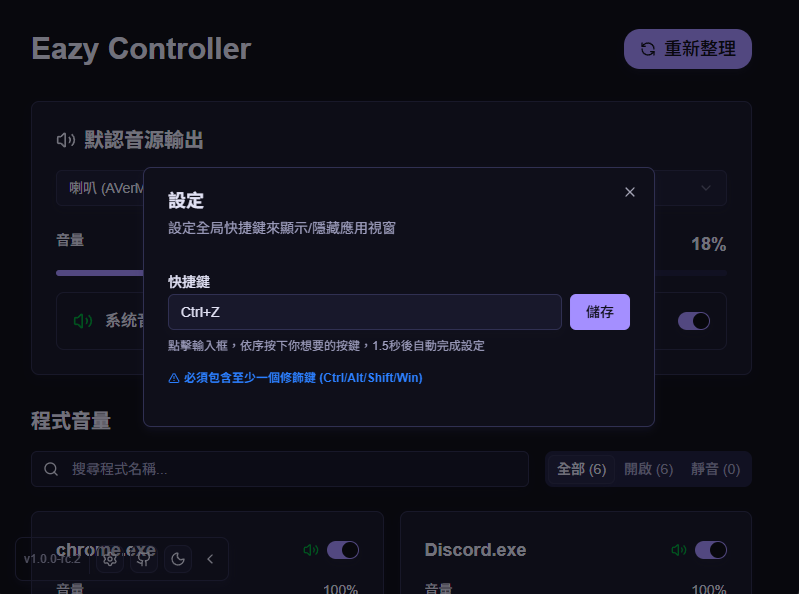
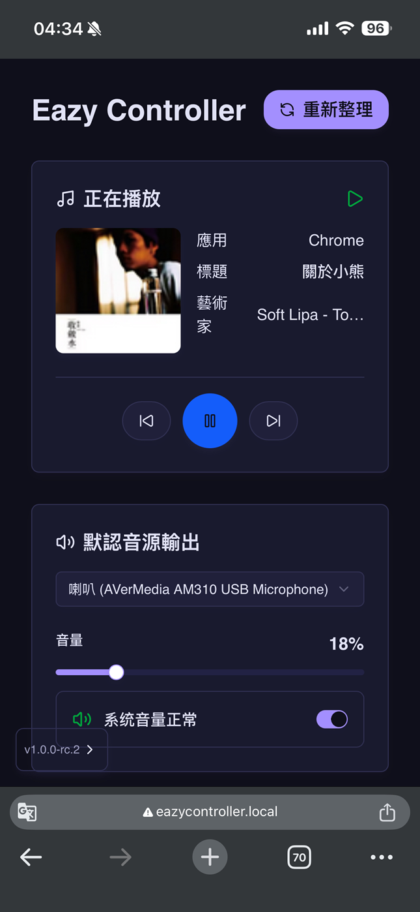

# EazyController

[](https://opensource.org/licenses/AGPL-3.0)
[](https://github.com/ExpTechTW/eazy-controller/releases)
[](https://github.com/ExpTechTW/eazy-controller/releases)
[](https://github.com/ExpTechTW/eazy-controller/actions)
[](https://github.com/ExpTechTW/eazy-controller)

<p align="center">
  <strong>簡單的控制音源輸出</strong>
</p>

<p align="center">
  <a href="README.md">繁體中文</a>
</p>

---

EazyController 是一款功能強大的音源輸出控制工具，幫助您快速管理系統的音源輸出裝置。透過直觀的操作介面，輕鬆切換和控制音源輸出，優化您的音訊體驗，也可以透過手機連接。

## 📥 下載與安裝

### 快速下載

<div align="center">
[](https://github.com/ExpTechTW/eazy-controller/releases/latest)

</div>

### 安裝步驟

<details>
<summary>🪟 Windows - 查看安裝步驟</summary>

<br>

1. **下載檔案** - 點擊上方按鈕下載 `.exe` 安裝程式
2. **執行安裝** - 雙擊下載的安裝程式
3. **安裝精靈** - 按照安裝精靈的指示完成安裝
4. **啟動** - 從開始選單或桌面捷徑啟動 EazyController

> **💡 提示**
> 如果 Windows Defender 顯示警告，請選擇「更多資訊」→「仍要執行」。

</details>

## 📋 支援的作業系統版本

### 🪟 Windows

<details>
<summary>查看支援版本列表</summary>

<br>


| 作業系統版本 | eazy-controller 版本 | 狀態 |
| ------------ | -------------------- | ---- |
| **8 及以下** | `-`                  | ❌   |
| **8.1**      | `1.0.0-rc.2`         | ⚠️ |
| **10**       | `1.0.0-rc.2`         | ✅   |
| **11**       | `1.0.0-rc.2`         | ✅   |

**架構支援**：x64 (64-bit)
**額外需求**：WebView2 執行環境（安裝程式會自動安裝）

> **⚠️ 注意**
>
> Windows 8.1 需要安裝 NET4.8，且深色模式可能異常。

</details>

## 🚀 使用介紹

EazyController 啟動後，會在您的本地電腦開啟一個網路服務端口，讓您可以在同一個區域網路內透過其他裝置（如手機、平板）來控制電腦的音源輸出。

### 📱 手機/其他裝置連接方式

在與電腦**同一個區域網路**的裝置上，您可以透過以下兩種方式連接：

1. **使用 mDNS 網址（推薦）**：
   ```
   http://eazycontroller.local/
   ```
   > 💡 如果無法使用此網址，請確保您的裝置和電腦都在同一個 Wi-Fi 網路中，且路由器支援 mDNS 功能。

2. **使用電腦的內網 IP 位址**：
   ```
   http://[您的電腦內網IP]:[端口號]/
   ```
   > 💡 您可以在 EazyController 主視窗中查看當前的 IP 位址和端口號。

### 🔍 如何查看電腦的內網 IP？

**Windows 10/11：**
1. 按 `Win + R` 開啟執行視窗
2. 輸入 `cmd` 並按 Enter
3. 在命令提示字元中輸入 `ipconfig`
4. 找到「IPv4 位址」，例如：`192.168.1.100`

## ✨ 功能特色

- 📊 **裝置列表管理**：清晰顯示並管理所有可用的音源輸出裝置
- ⚡ **快速切換**：一鍵快速切換音源輸出裝置，提升使用效率
- 🎚️ **即時狀態**：即時顯示當前使用的音源輸出裝置狀態和資訊
- 🌓 **深色模式**：美觀的深色/淺色主題切換
- 📱 **手機控制** : 手機也能控制電腦音訊

## 📸 電腦螢幕截圖

<div align="center">

<table>
  <tr>
    <td width="50%">
      
    </td>
    <td width="50%">
      
    </td>
  </tr>
</table>

</div>

## 手機螢幕截圖

<table>
  <tr>
    <td width="100%">
      
    </td>
  </tr>
</table>

## 📄 授權條款

本專案為開源專案，採用 [AGPL-3.0](LICENSE) 授權條款。

## 🤝 貢獻

歡迎貢獻！如果您想為此專案做出貢獻，請隨時提交 Pull Request 或開啟 Issue。

### 貢獻者

感謝所有為此專案做出貢獻的開發者！

<a href="https://github.com/exptechtw/eazy-controller/graphs/contributors">
  
</a>

---

<p align="center">
  如果這個專案對您有幫助，請給我們一個 ⭐️ Star！
</p>
